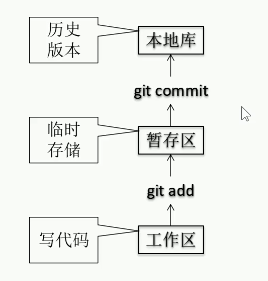

# Git

---

# 1 Git简介

## 1.1 git结构

## 1.2 Git和代码托管中心

      代码托管中心：维护远程库

- 局域网环境下
    - GitLab服务器
- 外网环境下
    - GitHub
    - 码云

## 1.3 本地库和远程库的交互方式

- 团队内

- 团队外

# 2 Git命令行操作

## 2.1 本地库操作

### 2.1.1 本地库初始化

- 命令：git init
- 效果：
    
    
    
- 注意：.git目录中存放的是本地库相关的子目录和文件，不要删除，也不要胡乱的修改。

## 2.1.2 设置签名

- 形式
    
    用户名：tom
    
    Email：goodMorning@xx.com
    
- 作用：区分不同开发人员的身份
- 辨析：这里设置的签名和登录远程库的账号和密码没有任何关系
- 命令：
    - 项目级别/仓库级别：尽在当前项目范围内有效；
        - git config [user.name](http://user.name) tom pro
        - git config [user.email](http://user.name.email) goodMorning_pro@xx.com
        - 保存的位置：.git/config
    - 系统用户级别：登录当前操作系统的用户范围；
        - git config —global [user.name](http://user.name) tom_glb
        - git config —gloabl user.email  goodMorning_glb@xx.name
        - 保存的位置：~/.gitconfig
    - 优先级
        - 就近原则：项目级别有限于系统级别
        - 如果只有系统用户级别的签名，就以系统用户级别的签名为准
        - 二者都没有不允许

### 2.1.3 添加提交以及查看状态操作

- 查看状态：git status
    
    
    
- 添加操作：git add <file name>
    
    将工作区的”新建/修改”添加进缓存区
    
- 提交操作：git commit -m “commit message” <file name>
    
    将暂存区的内容提交给本地库
    

### 2.1.4 版本穿梭测试

- 查看历史记录
    - git log [—pretty==oneline, —oneline]
    - git reflog
        - HEAD@{移动到当前版本需要的步数}
- 前进后退
    - 本质
        
        
        
    - 基于索引值操作【推荐】
        - git reset —hard <局部索引值>
    - 使用^符号：只能后退
        - git reset —hard HEAD^
    - 使用~符号：只能后退
        - git reset —hard HEAD~n

### 2.1.5 reset 三个参数对比

- —soft
    - 仅仅在本地库移动HEAD指针
    
    
    
- —mixed
    - 在本地库移动HEAD指针
    - 重置暂存区
        
        
        
- —hard
    - 在本地库移动HEAD指针
    - 重置暂存器
    - 重置工作区
        
        
        

### 2.1.6 删除文件找回

- 前提：删除前，文件存在时的状态提交到了本地库
- 操作：git reset —hard [指针位置]
    - 删除操作已经提交到本地库：指针位置指向历史记录
    - 删除操作未提交到本地库：指针位置为HEAD

### 2.1.7 比较文件

- git diff <文件名>
    - 将工作区的文件和暂存区进行比较
- git diff <本地库中的历史版本> <w文件名>
    - 将工作区的文件和本地库历史记录比较
- 不带文件名，比较多个文件

### 2.1.8 分支管理

- 什么是分支
    
    在版本控制过程中，使用多条线同时推进多个任务 
    
    
    
- 分支的好处
    - 同时并行推进多个功能的开发，提高开发效率
    - 各个分支在开发过程中，如果某一个分支开发失败，不会对其他分支有任何影响，失败的分支删除重开即可
- 分支操作
    - 创建分支
        - git branch <分支名称>
    - 查看分支
        - git branch -v
    - 切换分支
        - git checkout <分支名称>
    - 合并分支
        - 切换到接受修改的分支上
        - git merge <指定分支名>
    - 解决冲突
        - 冲突的表现
            
            
            
        - 冲突解决
            - 编辑文件，删除特殊符号
            - 把文件修改到满意为止，保存退出
            - git add <文件名>
            - git commit -m “日志信息”，此时commit一定不能带具体文件名

## 2.2 远程库操作

- 推送
    - git remote add <别名> 远程仓库地址
    - git push <别名> <分支名>
- 克隆
    - git clone <远程地址>
    - 效果
        - 完成把远程库下载到本地
        - 创建远程地址别名
        - 初始化本地库
- pull=featch+merge
    - git featch <远程地址别名> <远程分支名>
    - git merge <远程地址别名/远程分支名>
- 解决冲突
    - 要点
        - 如果不是基于github远程库的最新版所做的修改，不能推送，必须先拉取
        - 拉取下来后如果冲突状态，则按照分支冲突解决操作即可