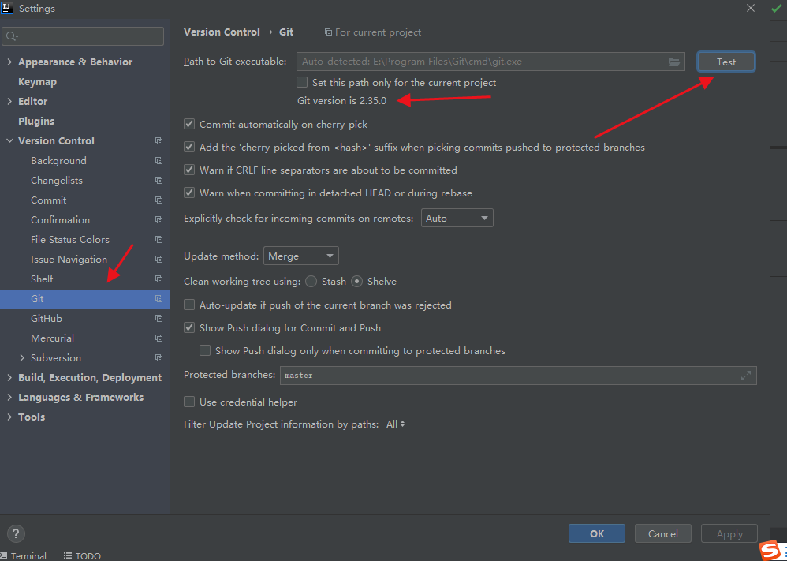

# IDEA+Git

---

# 1. 配置Git

# 2. 创建git本地库

# 3. IDEA提交本地库

## 3.1. 添加进缓存区

- 右键项目/文件⇒Git⇒Add
    
    
    
    - 文件由红变绿

## 3.2. 提交到本地库

- 右键项目/文件⇒Git⇒Commit Directory
    
    
    
- 选择提交文件，填写提交信息，点击提交
    
    
    
- 设置git签名
    
    
    
- 文件名由绿变黑

## 3.3. 切换版本

- 当修改文件后，文件将变为蓝色
- 将文件添加进缓存区
- 提交到本地库
- 设置提交信息，并提交，文件变为黑色
    
    
    
- 查看版本变化
    
    
    
    - 可以查看master所处的版本以及HEAD指针所指位置
- 切换版本
    - 右键指定版本，选择checkout
        
        
        

## 3.3. 切换分支

- 右键项目⇒Git⇒Repository⇒Branches⇒new branch
- 或者单击IDEA右下角
    
    
    
    
    

## 3.4. 合并分支

### 3.4.1. 正常合并

在master分支上合并hot-fix分支，直接合并

### 3.4.2. 冲突合并

- 在master分支上，点击hot-fix分支的Merge into Current，点击Merge
    
    
    
    
    
- 修改后，点击Apply
    
    
    

# 4. IDEA集成GitHub

## 4.1. 设置GitHub账号

## 4.2 将项目分享到GitHub上

## 4.3. 推送代码到远程库

- 第一种
    
    
    
- 第二种
    
    
    
- 若设置了ssh免密登录，可自定义远程连接
    
    
    
- 注意: push是将本地库代码推送到远程库,如果本地库代码跟远程库代码版本不一致，push的操作是会被拒绝的。也就是说，要想push成功，一定要保证本地库的版本要比远程库的版本高!因此一个成熟的程序员在动手改本地代码之前，一定会先检查下远程库跟本地代码的区别!如果本地的代码版本已经落后，切记要先pull拉取一下远程库的代码，将本地代码更新到最新以后，然后再修改，提交，推送!

## 4.4. 拉取远程库

- 注意:pull是拉取远端仓库代码到本地，如果远程库代码和本地库代码不一致，会自动合并，如果自动合并失败，还会涉及到手动解决冲突的问题。

## 4.5. clone远程库

- 第一步
    
    
    
- 第二步
    
    